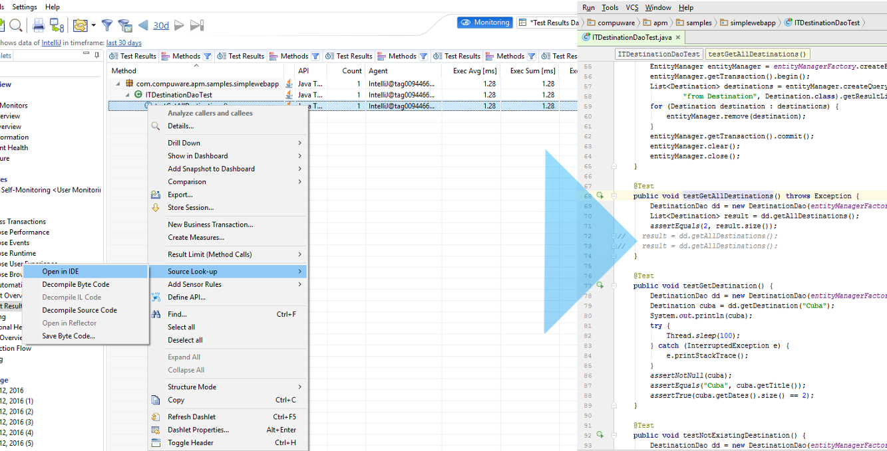

# Dynatrace CodeLink Wrapper

This library provides an easy to use Java implementation of Dynatrace Client's CodeLink feature.

### Table of Contents
- [What is CodeLink?](#codelink)
- [IDEs currently supporting CodeLink](#ides)
- [Usage](#usage)
    - [Installation](#Installation) 


## <a name="codelink"></a> What is CodeLink?

> The ability to navigate from Dynatrace AppMon Client to code in your favorite IDE with Dynatrace plugin. E.g. this is available in the PurePaths view, from the PurePath Tree section: after right-clicking on a message call, selecting Source Lookup / Open in IDE. 



## <a name="ides"></a>IDEs currently supporting CodeLink

- [Eclipse](https://eclipse.org) with [Eclipse Integration Plugin](https://github.com/Dynatrace/Dynatrace-Eclipse-Integration-Plugin)
- [IntelliJ IDEA](https://www.jetbrains.com/idea/) with [IDEA Integration Plugin](https://community.dynatrace.com/community/pages/viewpage.action?pageId=68649064)
- [Visual Studio 2010, 2012, 2013]() with [Visual Studio 2010, 2012 and 2013 IDE Plugins](https://community.dynatrace.com/community/pages/viewpage.action?pageId=47186029)

## Usage

### Installation
Manual installation is currently required, maven repository might be available in the future.
The wrapper comes with Apache's HttpComponents shaded inside, thus you don't have to worry about library dependencies.

#### Maven
- Download the latest artifact from [Releases](/releases)
- Put the artifact under */repo/com/dynatrace/codelink*
- Add the following code to the *&lt;repositories&gt;* section:

```xml
<repository>
    <id>local-repo</id>
    <releases>
        <enabled>true</enabled>
        <checksumPolicy>ignore</checksumPolicy>
    </releases>
    <snapshots>
        <enabled>false</enabled>
    </snapshots>
    <url>file://${project.basedir}/repo</url>
</repository>
```

- Add the following code to the *&lt;dependencies&gt;* section:

```xml
<dependency>
    <groupId>com.dynatrace.codelink</groupId>
    <artifactId>codelink-wrapper</artifactId>
    <version>0.0.1</version>
</dependency>
```

#### Gradle
- Download the latest artifact from [Releases](/releases)
- Put the artifact under */lib*
- Put the following code in your *dependencies* block:

```groovy
compile fileTree(dir: 'lib', include: '*.jar')
```

### Integrating an IDE with CodeLink using this library

CodeLink-Wrapper exposes three interfaces which have to be implemented:
- [CodeLinkSettings](src/main/java/com/dynatrace/codelink/CodeLinkSettings.java) - the basic implementation is available under [BasicCodeLinkSettings](src/main/java/com/dynatrace/codelink/BasicCodeLinkSettings.java)
- [IDEDescriptor](src/main/java/com/dynatrace/codelink/IDEDescriptor.java)
- [ProjectDescriptor](src/main/java/com/dynatrace/codelink/ProjectDescriptor.java)

The typical use-case looks as following:

```java
CodeLinkClient client = new CodeLinkClient(new YourCodeLinkSettings(), new YourIDEDescriptor(), new YourProjectDescriptor());
client.startPolling(CodeLinkClient.DEFAULT_INTERVAL, CodeLinkClient.DEFAULT_UNIT);
```

Incoming lookup requests will call a *jumpToClass* method in *[ProjectDescriptor](src/main/java/com/dynatrace/codelink/ProjectDescriptor.java)*, that's where one has to implement the jumping logic.

One thing to keep in mind is the format of *className* inside *[CodeLinkLookupResponse](src/main/java/com/dynatrace/codelink/CodeLinkLookupResponse.java)*. It follows the *OuterClass$InnerClass$InnerClass* format.
Typically you will have to split the string on *$* in order to search for classes.

The *getId()* method in [IDEDescriptor](src/main/java/com/dynatrace/codelink/IDEDescriptor.java#L54) returns the ID associated with an IDE.


The ID which the function returns needs to be registered on the Dynatrace Client side. To do that, you have to contact Dynatrace directly.

You can use ECLIPSE Id: *0* *[IDEDescriptor.ECLIPSE_ID](src/main/java/com/dynatrace/codelink/IDEDescriptor.java)* until the IDE you are writing the implementation for is registered.